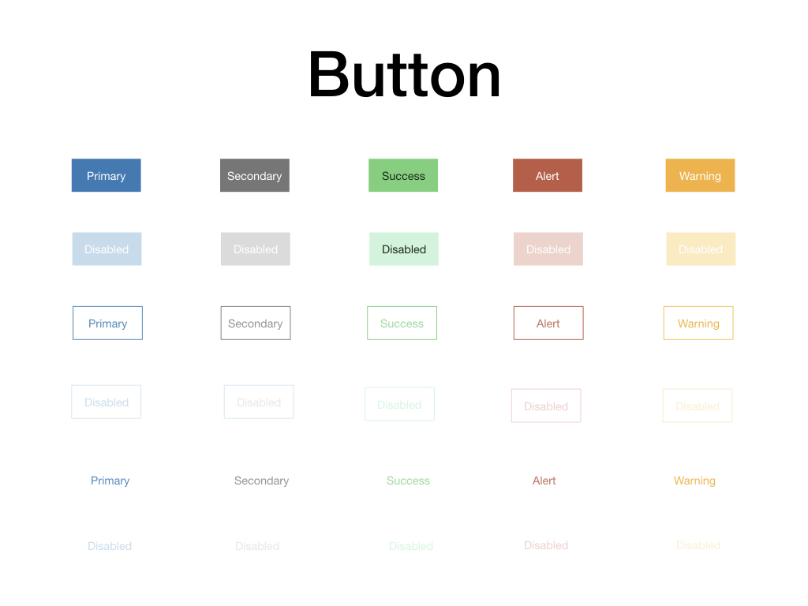
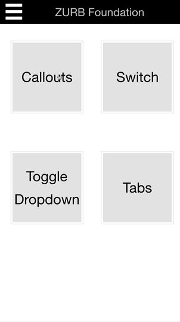

## About

**keynote-foundation-kit** is a set of [Foundation Zurb v6](https://foundation.zurb.com) objects to create fast mockups, prototypes using Apple's Keynote application

## Download

[Foundation 6 UI.key]("./Foundation 6 UI.key")

## overview

[Foundation 6 UI.pdf](files/Foundation-6-UI.pdf "PDF overview")

### an example page

## Prototyping Process

1. Sketch a template using paper and pencil or find templates from internet to get some ideas
2. find images
3. create a new keynote file
4. copy and paste objects from "Foundation 6 UI.key" to the new keynote file. And place them like in your sketch
5. add links between slides
6. add animations

## Demos

Few prototypes can be found in [demos](./demos) directory

### iPhone 6 Demo

click [here](demos/iphone-6-demo.key) to download keynote file

### Website Demo

click [here](demos/website-demo.key) to download keynote file

